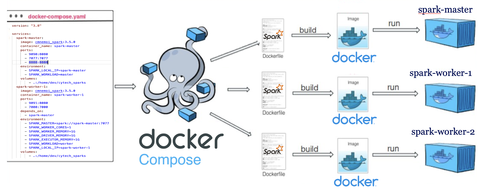
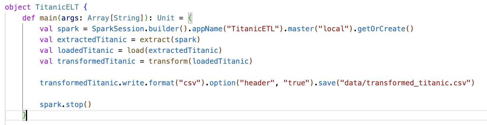
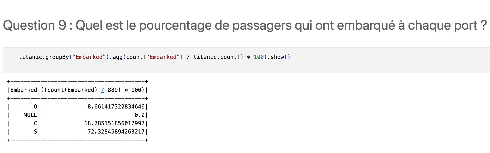

# Cours sur le traitement de données "Big Data" avec Spark

Dépôt pour notre cours sur Spark pour le cours de "Programmation Fonctionnelle" à CY Tech.

Auteurs : Aïcha Lehbib, Ahmed Ouinekh, Charles-Meldhine Madi Mnemoi, Lucas Terra, Jalis Aït-Ouakli, Youssef Saïdi

# Installation

Clonez ce dépôt sur votre machine avec la commande `git clone https://github.com/cmnemoi/cytech_sparks.git && cd cytech_sparks` ou bien téléchargez le dépôt compressé en cliquant [ici](https://github.com/cmnemoi/cytech_sparks/archive/main.zip).

Pour profiter du cours, il faut **Docker** sur votre machine.  **Docker** devrait déjà être installé sur les PC CY Tech, **sous Linux** (ouvrez un terminal et tapez `docker --version` pour vérifier).

Si ce n'est pas le cas, vous pouvez suivre les instructions d'installation sur le site officiel de [Docker](https://docs.docker.com/get-docker/).
 
Une fois ce dépôt téléchargé sur votre machine, il vous suffit de lancer la commande `make` pour installer le cluster Spark utilisé pour le cours.

Ce cours est composé de :

- de slides de présentation ([`presentation.pptx`](presentation.pptx))
- notebooks Jupyter avec des exercices pratiques (dans le dossier [`notebooks`](notebooks)). Vous pouvez les ouvrir avec la commande `make jupyter` et en allant sur l'URL `http://localhost:8888` dans votre navigateur.
- de jobs Spark à exécuter sur le cluster (dans le dossier [`src/main/scala`](src/main/scala)). Vous pouvez par exemple exécuter l'ELT avec la commande `make elt`.

# Curriculum du cours

# Partie 1 : Présentation du Big Data, Apache Spark et installation du cluster

- Big Data : les 3V (Volume, Vélocité, Variété)
- En quoi Spark est-il un outil adapté au Big Data ?
- Installation d'un cluster Spark avec Docker

# Partie 2 : Création d'un ELT avec Spark SQL

- Définition d'un ELT (Extract, Load, Transform)
- Cas pratique sur les données Titanic
  - Extraction des données à partir de plusieurs fichiers
  - Chargement des données dans un DataFrame
  - Transformation des données : nettoyage, création de nouvelles variables

**[Notebook - Création d'un ELT avec Spark SQL](notebooks/001_Création_d'un_ELT_avec_Spark_SQL.ipynb)**

# Partie 3 : Analyse de données avec les Spark DataFrames

- Quelques fonctions utiles inspirés de la programmation fonctionnelle (`filter`, `sort`, `groupBy`, `count`...)
- Exercices pratiques sur le jeu de données Titanic

**[Notebook - Analyse de données avec les Spark DataFrames](notebooks/002_Analyse_de_données_avec_les_Spark_DataFrames.ipynb)**

# Partie 4 : Création d'un modèle de Machine Learning avec Spark MLlib

- Méthodologie d'un projet de Machine Learning (définition du problème, train/test split, création du modèle et évaluation)
- Cas pratique sur des données d'examples fournies par Spark

# Partie 5 : Analyse de données graphes avec Spark GraphX

- Qu'est ce qu'un graphe ?
- Cas pratique sur un exemple de réseau social fictif

# [Lien vers les slides du cours](presentation.pptx)

